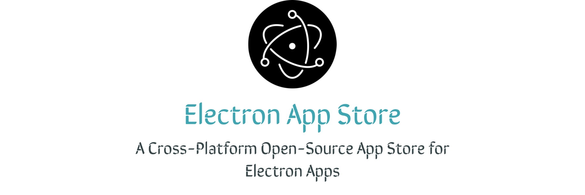

# The Electron App Store

&nbsp;&nbsp;&nbsp;

A Cross Platform App Store just for Electron Apps  
## Features
- Browse Apps from 10+  Categories
- Search for apps by keyword and app name
- Download .exe , .appimage ,.dmg and other file formats
- Automatic Install for .exe files (.appimage soon, see roadmap)
- Loads the app website if the ReadMe is absent for the app page 
- Is dark mode a Feature?

  
## Screenshots

## Roadmap
- Install apps without spawning the installer modal
- Support installation of Appimages ✔️
- Create a CLI that has the same functionalty
- Encourage a Common ReadMe format from the app developers to have the app pages look more seeamless
- Support for Youtube preview videos shown on the website

## Installation
You can download for your Platform by visiting our [website](https://electron-app-store.ml) or for Linux you can get the **Snap** from **Snapcraft**:  

## Contributing

Drop your pull requests. We are all for It. Lets have fun in building this project. 

## Community
You can join us on **Telegram** or **Discord**!

### Telegram
Just join us on **Telegram** by Clicking this [Link](https://t.me/joinchat/nQ4nckbe-dM3ZDVk)

### Discord
Let's chat on **Discord** by Clicking this [link](https://discord.gg/Hdgcqq9C)!
## Why build this ?
I love checking out new apps. So occasionally I visit  this page https://electronjs.org/apps to find out about new stuff.
After some time I just wished the website was an appstore and was like "Maybe I can convert to an store. Easy peezy, right?".
And then after months of postponing this side project I decided to take a brake from building [FLB Music](https://github.com/Patrick-web/FLB-Music-Player-Official) and make it. And also because I love Electron.js.
